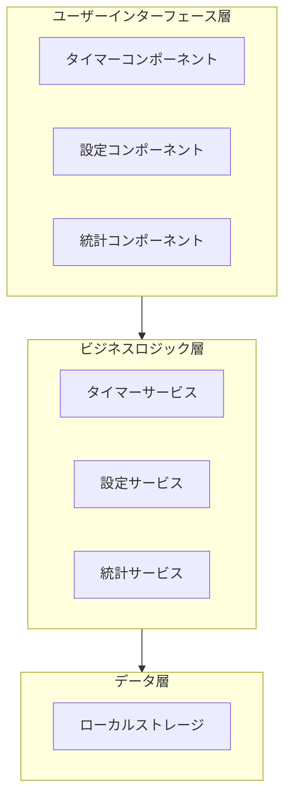
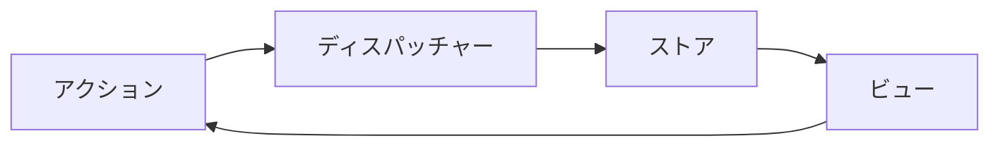
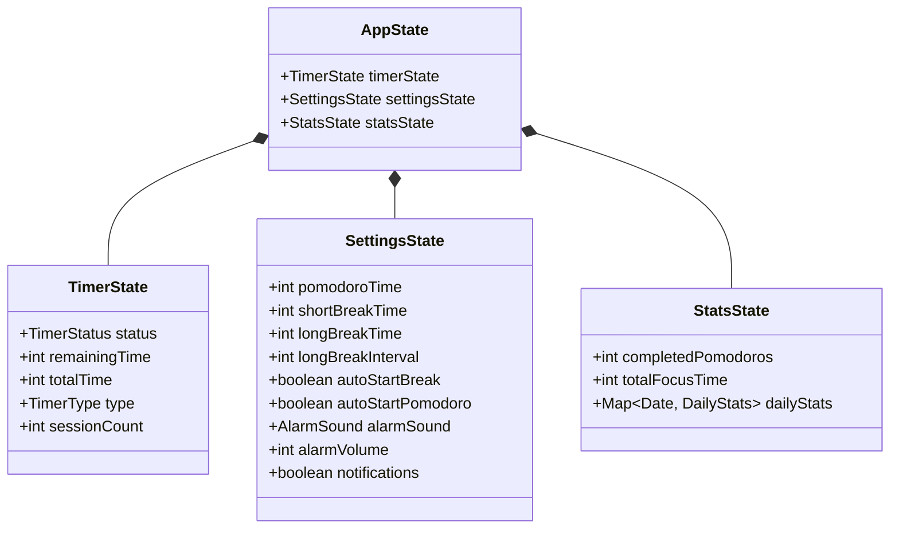
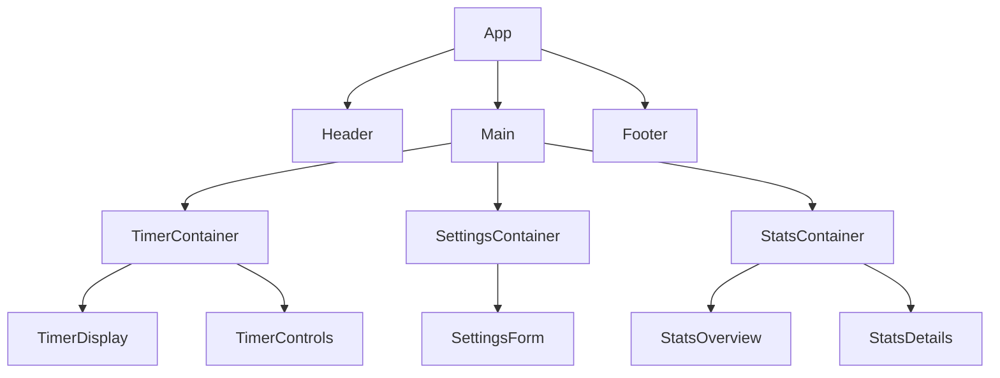
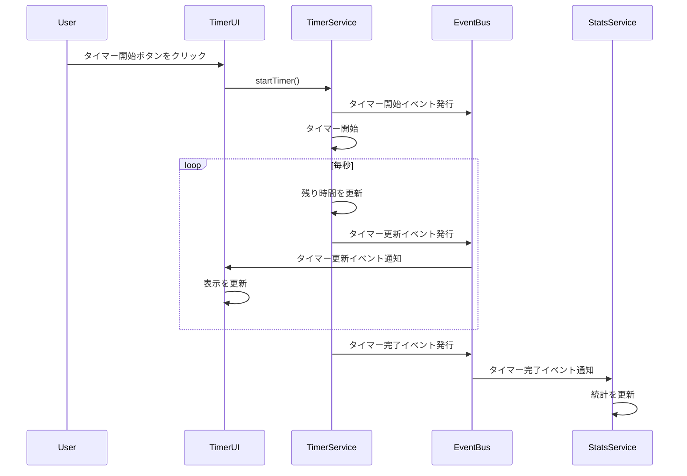

# ポモドーロタイマー Web アプリ - システムパターン

## システムアーキテクチャ

このポモドーロタイマーアプリケーションは、フロントエンド中心のシングルページアプリケーション（SPA）として設計されています。主要なアーキテクチャパターンとして、コンポーネントベースのアーキテクチャを採用し、状態管理にはフラックスパターンを使用します。



## コアモジュール構成

アプリケーションは以下の主要モジュールで構成されています：

1. **アプリモジュール**: アプリケーション全体の初期化と調整を担当
2. **タイマーモジュール**: ポモドーロタイマーの核となる機能を提供
3. **設定モジュール**: ユーザー設定の管理を担当
4. **統計モジュール**: ユーザーの使用統計を記録・表示

## データフロー

アプリケーションのデータフローは単方向に設計されています：



1. **ユーザーアクション**: ユーザーが UI で操作を行う（例：タイマー開始ボタンをクリック）
2. **アクション発行**: アクションが生成され、ディスパッチャーに送信される
3. **状態更新**: ストアがアクションを受け取り、状態を更新
4. **UI 更新**: 新しい状態に基づいて UI が再レンダリングされる

## 状態管理

アプリケーションの状態は中央集権的に管理され、以下の主要な状態を持ちます：



## コンポーネント関係

UI コンポーネントは以下のような階層構造で構成されています：



## 主要なデザインパターン

1. **コンポーネントパターン**: UI を再利用可能なコンポーネントに分割
2. **オブザーバーパターン**: 状態変更の通知と反応的な UI 更新
3. **コマンドパターン**: タイマー操作（開始、一時停止、リセットなど）をカプセル化
4. **ストラテジーパターン**: 異なる通知方法やアラーム音の実装
5. **ファクトリーパターン**: 異なるタイプのタイマー（ポモドーロ、短い休憩、長い休憩）の生成
6. **プロキシパターン**: ローカルストレージへのアクセスを抽象化

## イベント駆動アーキテクチャ

タイマーの状態変更はイベント駆動型で実装されています：



## データ永続化

ユーザーデータはブラウザのローカルストレージに保存され、以下のような構造を持ちます：

```
localStorage: {
  "pomodoro-settings": {
    pomodoroTime: 25,
    shortBreakTime: 5,
    longBreakTime: 15,
    longBreakInterval: 4,
    autoStartBreak: false,
    autoStartPomodoro: false,
    alarmSound: "bell",
    alarmVolume: 70,
    notifications: true
  },
  "pomodoro-stats": {
    completedPomodoros: 42,
    totalFocusTime: 1050,
    dailyStats: {
      "2025-03-14": {
        completedPomodoros: 8,
        totalFocusTime: 200
      },
      ...
    }
  },
  "pomodoro-state": {
    status: "running",
    remainingTime: 843,
    totalTime: 1500,
    type: "pomodoro",
    sessionCount: 2
  }
}
```

## エラー処理戦略

アプリケーションは以下のエラー処理戦略を採用しています：

1. **境界エラー処理**: コンポーネント境界でのエラーキャッチと回復
2. **グレースフルデグラデーション**: 機能の一部が失敗しても、アプリケーション全体は動作を継続
3. **ユーザーフレンドリーなエラーメッセージ**: 技術的な詳細ではなく、ユーザーが理解できる言葉でエラーを説明
4. **自動リカバリー**: 可能な場合は自動的にエラーから回復（例：ローカルストレージが利用できない場合はメモリ内で動作）

## パフォーマンス最適化

1. **メモ化**: 不必要な再計算を避けるためのコンポーネントとデータのメモ化
2. **レンダリング最適化**: 必要な部分のみを再レンダリング
3. **遅延読み込み**: 必要になるまでコンポーネントやリソースを読み込まない
4. **デバウンシング**: 頻繁に発生するイベント（設定変更など）の処理を最適化

## アクセシビリティ設計

アプリケーションは以下のアクセシビリティ原則に従って設計されています：

1. **キーボードナビゲーション**: すべての機能がキーボードだけで操作可能
2. **スクリーンリーダー対応**: 適切な ARIA 属性とセマンティック HTML の使用
3. **十分なコントラスト**: テキストと背景のコントラスト比が WCAG ガイドラインに準拠
4. **フォーカス管理**: キーボードフォーカスの視覚的な表示と論理的な移動順序
