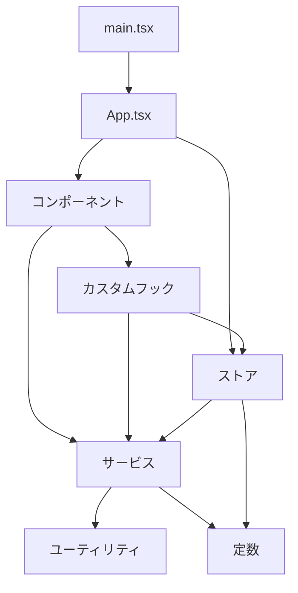

# ポモドーロタイマー Web アプリ - 技術コンテキスト

## 技術スタック概要

このポモドーロタイマーアプリケーションは、モダンなフロントエンド技術を使用して構築されています。主にクライアントサイドで動作し、ブラウザのローカルストレージを活用してデータを永続化します。

### フロントエンド技術

- **JavaScript フレームワーク**: モダンな JavaScript フレームワークを使用
- **HTML5/CSS3**: レスポンシブデザインとモバイルファーストアプローチ
- **ローカルストレージ API**: ユーザー設定と統計データの保存
- **Web Notifications API**: タイマー完了時の通知
- **Web Audio API**: アラーム音の再生

## 開発環境

### 開発ツール

- **パッケージマネージャー**: npm または yarn
- **ビルドツール**: Vite（高速な開発環境と最適化されたビルド）
- **コードエディタ**: VS Code（推奨）
- **バージョン管理**: Git

### テスト環境

- **テストフレームワーク**: Vitest
- **コンポーネントテスト**: Testing Library
- **E2E テスト**: Playwright または Cypress

### コード品質ツール

- **リンター**: ESLint
- **フォーマッター**: Prettier
- **型チェック**: TypeScript

## 技術的制約と考慮事項

### ブラウザ互換性

- **サポートブラウザ**: 最新の Chrome, Firefox, Safari, Edge
- **最小要件**: ES6 互換ブラウザ
- **レスポンシブ対応**: モバイル、タブレット、デスクトップに対応

### パフォーマンス要件

- **初期読み込み時間**: 2 秒以内（最適化されたバンドルサイズ）
- **タイマー精度**: 1 秒以内の誤差に抑える
- **アニメーションのスムーズさ**: 60fps を維持

### セキュリティ考慮事項

- **データ保存**: センシティブなデータは保存しない
- **サードパーティライブラリ**: 定期的に脆弱性をチェック
- **CSP (Content Security Policy)**: インラインスクリプトを制限

### アクセシビリティ要件

- **WCAG 準拠**: AA レベルのアクセシビリティ基準を満たす
- **キーボードナビゲーション**: すべての機能をキーボードで操作可能に
- **スクリーンリーダー対応**: 適切な ARIA ラベルとセマンティック HTML

## 依存関係

### コア依存関係

```json
{
  "dependencies": {
    "react": "^18.2.0",
    "react-dom": "^18.2.0"
  },
  "devDependencies": {
    "vite": "^4.4.0",
    "vitest": "^0.34.0",
    "@testing-library/react": "^14.0.0",
    "eslint": "^8.44.0",
    "prettier": "^3.0.0",
    "typescript": "^5.1.6"
  }
}
```

### 主要なライブラリと用途

- **状態管理**: Redux または Zustand
- **スタイリング**: CSS Modules または Tailwind CSS
- **アニメーション**: Framer Motion または CSS アニメーション
- **アイコン**: React Icons または SVG アイコン
- **日付処理**: date-fns（軽量な日付操作ライブラリ）
- **グラフ表示**: Chart.js または Recharts（統計表示用）

## アーキテクチャ詳細

### ディレクトリ構造

```
src/
├── assets/          # 静的アセット（音声、画像など）
├── components/      # 再利用可能なUIコンポーネント
│   ├── common/      # 汎用コンポーネント
│   ├── timer/       # タイマー関連コンポーネント
│   ├── settings/    # 設定関連コンポーネント
│   └── stats/       # 統計関連コンポーネント
├── hooks/           # カスタムReactフック
├── store/           # 状態管理
│   ├── actions/     # アクション定義
│   ├── reducers/    # リデューサー
│   └── selectors/   # セレクター
├── services/        # ビジネスロジックとサービス
│   ├── timer/       # タイマーサービス
│   ├── storage/     # ストレージサービス
│   ├── notification/# 通知サービス
│   └── stats/       # 統計サービス
├── utils/           # ユーティリティ関数
├── types/           # TypeScript型定義
├── constants/       # 定数定義
├── App.tsx          # メインアプリケーションコンポーネント
└── main.tsx         # エントリーポイント
```

### モジュール間の依存関係



## 技術的な決定事項

### タイマー実装

タイマーの実装には `requestAnimationFrame` を使用し、以下の理由で `setInterval` は避けています：

1. より正確なタイミング
2. ブラウザのパフォーマンス最適化
3. バックグラウンドタブでの動作改善

タイマーの精度を保つため、実際の経過時間を計算するためにタイムスタンプを使用します：

```javascript
class TimerService {
  constructor() {
    this.startTime = 0;
    this.remainingTime = 0;
    this.timerId = null;
    this.lastTimestamp = 0;
  }

  start(duration) {
    this.startTime = Date.now();
    this.remainingTime = duration * 1000; // ミリ秒に変換
    this.lastTimestamp = this.startTime;
    this.tick();
  }

  tick() {
    const now = Date.now();
    const elapsed = now - this.lastTimestamp;

    this.lastTimestamp = now;
    this.remainingTime -= elapsed;

    if (this.remainingTime <= 0) {
      this.complete();
      return;
    }

    this.timerId = requestAnimationFrame(() => this.tick());
  }

  // その他のメソッド...
}
```

### ローカルストレージ戦略

データの永続化にはブラウザのローカルストレージを使用し、以下のパターンで実装します：

1. **抽象化レイヤー**: 直接 localStorage にアクセスせず、ストレージサービスを介してアクセス
2. **シリアライズ/デシリアライズ**: JSON 形式でデータを保存・取得
3. **バージョニング**: スキーマ変更に対応するためのバージョン情報の保存
4. **エラー処理**: ストレージが利用できない場合のフォールバック

```javascript
class StorageService {
  constructor(namespace) {
    this.namespace = namespace;
  }

  save(key, data) {
    try {
      const fullKey = `${this.namespace}-${key}`;
      localStorage.setItem(fullKey, JSON.stringify(data));
      return true;
    } catch (error) {
      console.error("Storage save error:", error);
      return false;
    }
  }

  load(key, defaultValue = null) {
    try {
      const fullKey = `${this.namespace}-${key}`;
      const data = localStorage.getItem(fullKey);
      return data ? JSON.parse(data) : defaultValue;
    } catch (error) {
      console.error("Storage load error:", error);
      return defaultValue;
    }
  }

  // その他のメソッド...
}
```

### 通知システム

ブラウザの Notification API を使用し、以下の点に注意して実装します：

1. **権限管理**: 初回使用時に通知許可を要求
2. **フォールバック**: 通知がサポートされていない環境ではオーディオのみで対応
3. **カスタマイズ**: ユーザーが通知のオン/オフを切り替え可能

```javascript
class NotificationService {
  constructor() {
    this.isSupported = "Notification" in window;
    this.isPermissionGranted = false;
  }

  async initialize() {
    if (!this.isSupported) return false;

    if (Notification.permission === "granted") {
      this.isPermissionGranted = true;
      return true;
    } else if (Notification.permission !== "denied") {
      const permission = await Notification.requestPermission();
      this.isPermissionGranted = permission === "granted";
      return this.isPermissionGranted;
    }

    return false;
  }

  notify(title, options = {}) {
    if (!this.isSupported || !this.isPermissionGranted) {
      // フォールバック: オーディオのみ
      return false;
    }

    return new Notification(title, options);
  }
}
```

## デプロイメント戦略

### ビルドプロセス

1. **開発ビルド**: 開発中の高速リロードと詳細なエラーメッセージ
2. **プロダクションビルド**: 最小化、コード分割、キャッシュ最適化

### ホスティングオプション

1. **静的ホスティング**: GitHub Pages, Netlify, Vercel など
2. **PWA (Progressive Web App)**: オフライン機能とインストール可能なアプリとして提供

### CI/CD パイプライン

1. **自動テスト**: プルリクエスト時に単体テストと統合テストを実行
2. **自動デプロイ**: メインブランチへのマージ時に自動デプロイ
3. **品質チェック**: コードカバレッジとリンターチェックの自動実行

## パフォーマンスモニタリング

### 主要なパフォーマンス指標

1. **First Contentful Paint (FCP)**: 最初のコンテンツが表示されるまでの時間
2. **Time to Interactive (TTI)**: インタラクティブになるまでの時間
3. **Total Blocking Time (TBT)**: メインスレッドのブロッキング時間

### モニタリングツール

1. **Lighthouse**: パフォーマンス、アクセシビリティ、SEO のスコア測定
2. **Web Vitals**: コアウェブバイタルの測定
3. **Chrome DevTools**: パフォーマンスプロファイリングとメモリ使用量の分析
